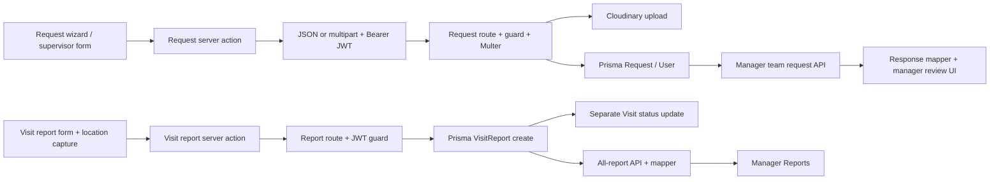

# Goldera delivery audit — 4 October 2026

**Readiness: not ready for delivery.** The production frontend build fails, public signup can mint a manager token, write endpoints permit cross-user changes, and repeated leave approval corrupts leave totals. Required visit-report topics are omitted from persistence. Application fixes have not been applied; this is the report and implementation plan for approval.

Scope confirmed by the user: request submission and manager Requests, plus visit-report submission and manager Reports. Existing uncommitted backend changes were included in the audit and preserved. Only audit artifacts were added to the repository. No configured-database records or Cloudinary files were created, updated, or deleted.

## Evidence and confidence

- **Runtime reproduction:** 32 isolated scenarios in [test-results.json](/Users/marwan/Documents/Golderapharm/audit/2026-10-04/test-results.json). The harness loads actual controllers, routes, JWT guard, Multer, frontend payload builders, server actions, and Zod schemas. Prisma operations and Cloudinary uploads are synthetic boundaries. These reproductions verify application decisions and outgoing database calls, not real database constraints or real file delivery.
- **Browser verification:** an unchanged frontend source copy in `/private/tmp/goldera-audit-frontend`, connected to the synthetic API. Sample submission, persisted display after refresh, manager approval, report display, validation, filtering, and keyboard tab navigation were exercised. Browser login is a fixture; actual signup was separately exercised through the real controller.
- **Real database, read-only:** connection succeeded; schema metadata was read for User, Request, Visit, and VisitReport; all **30** repository migrations are recorded as completed, with no pending local migrations. [database-metadata.json](/Users/marwan/Documents/Golderapharm/audit/2026-10-04/database-metadata.json). This is not a comprehensive schema-drift or historical-data audit.
- **Static verification:** source TypeScript passes; ESLint has 0 errors and 4 warnings; Prisma schema validation passes; selected backend files pass `node --check`.
- **Production build:** compilation succeeds, then Next.js generated page types fail. [build.log](/Users/marwan/Documents/Golderapharm/audit/2026-10-04/build.log). A subsequent check of generated types confirms that manager Requests and Reports have the same incompatible props. [generated-types.log](/Users/marwan/Documents/Golderapharm/audit/2026-10-04/generated-types.log).

The installed browser CLI was unavailable, so browser verification used Codex computer-use APIs. The temporary frontend needed webpack because Turbopack rejects a dependency symlink outside its filesystem root; that temporary-copy limitation is not an application defect. The production build was also run with webpack and failed on application types.

## System map

| Layer | Implementation and relevant configuration |
|---|---|
| Frontend | `goldFront`: Next.js 16.1, React 19, TypeScript, React Hook Form/Zod, Radix UI, Tailwind. App Router pages, feature-local API actions, shared `services/http.ts`. |
| Authentication | Frontend HTTP-only `token` cookie, forwarded as Bearer JWT by server actions. `proxy.ts` decodes role/expiry for navigation; dashboard layout verifies profile through the backend. Backend guard verifies JWT and retrieves the current database role. |
| Backend | `goldBack`: Express 5, ES modules, `/api/*` routes, role middleware, controller business logic, global error middleware. JSON body limit 20 KB; Multer memory uploads. |
| Database | PostgreSQL through Prisma 7 and `@prisma/adapter-pg`; schema and 30 migrations under `goldBack/prisma`. UUID primary keys; relations from requests/reports/visits to User and Doctor. |
| Files | Cloudinary raw uploads via `utils/cloudinary.js`; metadata stored in Request.pdfs as JSON objects with name, public_id, url. No authenticated file-download route found for this flow. |
| Shared contracts | Frontend-only DTOs under `features/requests/lib/types`, `features/visits/lib/types/report.ts`, `features/reports/lib/types`, and `lib/types`. Backend has Prisma models and controller destructuring; no runtime schema shared with the frontend. |
| Environment | Existing frontend `.env` points to a deployed API, while local backend listens on 5050. Audited local UI on 3001 used only synthetic API 5069. Database credentials were used only for read-only metadata checks. Secret values are absent from this report. |
| Delivery configuration | Frontend server-action body limit 5 MB; backend allows 5 MiB **per file**, up to 10 pdfs. This prevents the complete advertised backend allowance from passing through frontend actions. Backend has no test/lint script; frontend has lint/build but no flow regression suite. Backend `.env.example` is already deleted in the user's working tree. |

### Request flow and expected behavior

1. Rep: `/rep/requests/new` renders CreateRequestWizard. Supervisor: `/supervisor/requests/submit` renders SubmitRequestForm, a separate implementation of the same request contract.
2. Both build title, subject, description, type, urgency and type-specific details. The wizard requires an attachment for every type except SAMPLE; the supervisor form does not enforce that requirement before calling the API.
3. `createRequestAction` sends JSON when no files exist; otherwise multipart with `pdfs`. It contains format fallback retries. Controller uploads files before creating Request, initially PENDING.
4. Personal history is fetched from `/api/requests`; team requests come from `/api/managers/team/requests` or `/api/supervisors/team/requests` with hierarchy predicates.
5. Manager review PATCHes `/api/requests/:id` with status and optional response. It then refreshes the UI. Approved LEAVE additionally increments User.leaveDaysCountTotal in a separate operation.

Expected minimum: submitted values survive serialization, type-specific required fields are validated by the server, supported files are accepted, recoverable failures keep entered values, authorized reviewers see the correct records, and a decision changes counters exactly once. Multi-tier approval details, attachment privacy, and leave counting rules require product decisions below.

### Visit-report flow and expected behavior

1. `/rep/visits/report?visitId=...` loads the rep's own visit list and selected visit plus the product catalog.
2. VisitReportForm collects duration, 1–5 rating, visit purpose, discussed topics, optional feedback/notes, and product-name samples. It requires fresh browser location before enabling Submit Report.
3. The action converts discussedTopicsText into a trimmed array; POST `/api/visits/visit-reports` creates a report, then updates Visit.status to COMPLETED.
4. Rep reports use the own-report endpoint; manager Reports uses `/api/visits/all-visit-reports`, maps names/dates, and renders a paginated, locally filtered directory.

Expected minimum: report belongs to an authorized visit, required input reaches storage, report creation and completion agree, duplicates do not silently repeat the completion, displayed attribution identifies the rep, and location behavior matches the stated product policy.

## Contract and naming mismatch table

“Intentional mapping” rows distinguish useful transformations from defects. Recommended changes need approval before implementation.

| Frontend name / shape | Backend name / shape | Affected location | Impact | Recommended correction |
|---|---|---|---|---|
| discussedTopicsText: string → discussedTopics: string[] | VisitReport.discussedTopics: String[]; controller omits it | `features/visits/api/reports.ts`; `controllers/visit.controller.js:246` | Text-to-array mapping is intentional; subsequent omission loses required content. | Retain mapping; validate and include discussedTopics in Prisma create. |
| completionLocation {latitude, longitude, accuracy, capturedAt} | No controller or database field | `VisitReportForm.tsx:100`; `api/reports.ts:112` | UI blocks completion for location it then discards. | Decide location policy; persist and validate it if required, or remove the requirement. |
| doctorIds on SAMPLE wizard payload | Only consumed for EXPENSE/MARKETING | `CreateRequestWizard.tsx:249`; `request-type-payload.ts:15`; request controller | Mandatory sample target doctors never survive payload building or persistence. | Decide whether samples require doctors; implement the relation or remove misleading input. |
| totalExpenseData: array | Multer canonical field is a JSON string; controller requires Array.isArray | `request-type-payload.ts:151`; request controller:165 | Canonical multipart returns 400; action needs four attempts to reach indexed fallback. | One agreed array serialization plus explicit parsing/schema validation on the server. |
| totalExpenseData[].amount: number | Indexed multipart fallback stores string amounts in JSON[] | `api/index.ts:120`; request controller:217 | Stored/returned types disagree; frontend mapper masks this using Number(). | Normalize numeric fields before persistence; validate finite/nonnegative amounts and total. |
| doctorIds + doctorIds[] + doctorIdsJson | req.body.doctorIds array | `request-type-payload.ts:75`; request controller:134 | One doctor becomes two identical Prisma connect entries under real Multer parsing. Database result was not tested. | Emit a single canonical field and deduplicate validated IDs. |
| invoice / medicalReport / personalExpenseInvoices | pdfs uploads → Request.pdfs | `appendRequestFiles`; request controller | Intentional field mapping; original filenames and per-expense-file association are lost. | Keep `pdfs` contract; add filename/purpose/item association if required. |
| Upload accepts PDF, PNG, JPG | Multer allows application/pdf only | `CreateRequestWizard.tsx:810`; `utils/multer.js` | Supported UI selection is rejected with 422. | Agree file types and enforce the same policy at both ends. |
| RequestUrgency lower-case union; builder capitalizes | Request.urgency free String | request types/buildCreateRequestPayload; Prisma Request | Lowercase-to-title-case mapping is explicit; response type still declares lowercase. | Choose canonical wire enum, normalize display separately, validate server-side. |
| representativeName / repName / user | Backend report includes visit.createdBy {id,name}; mapper drops it | reports API; manager report component:769 | Cards and representative search lose attribution. | Map report author explicitly; align DTO, mapper, and component. Consider report.createdBy rather than visit owner where they differ. |
| doctorIds / doctorName / doctors | Request has doctors relation; manager team query omits include | manager controller:479; RequestTypeDetails.tsx:103 | Manager shows zero/missing doctors for requests with connected doctors. Mapper does not derive doctorName/doctorIds either. | Include doctors and derive display fields from the relation. |
| productsId?: string[] | Request.productsId String?; sampleData holds multiple products | request types vs Prisma Request | Type-level mismatch and ambiguous legacy fields. Current sample UI uses sampleData. | Define one sample contract; remove unused aliases or type singular relation correctly. |
| CreateVisitReportResponse: optional id/message or null | {status,message,data:VisitReport}, status 200 | visits report types/API vs report controller | Action ignores returned report and cannot reconcile a saved record after ambiguous failure. | Type the real envelope and return record ID/status to caller; agree create status. |
| notes: string in reports types | notes String?; response can be null | reports/lib/types vs Prisma VisitReport | Compile-time contract overstates availability. | Type string \| null; preserve existing UI null handling. |
| ApiError.statusCode and code | Error JSON has status/message, generally no statusCode/code | `services/http.ts`; global error middleware | Actual 400 appears as 500 in action result; codes are synthetic fallbacks. | Merge HTTP status into normalized error; agree stable error code/field structure. |
| searchParams object / params object | Next.js generated PageProps require Promise | manager Requests/Reports and other page files | Whole production build fails. | Promise-typed page inputs, awaited once, throughout affected App Router pages. |
| createdAt → submittedDate; responseDate → reviewedDate; user → rep | Backend createdAt, responseDate, user | request response mapper:53 | Intentional display mappings. Empty reviewer name is a data gap, not a spelling defect. | Preserve explicit mappings; add reviewer identity/history only after workflow agreement. |

IDs are declared UUID-backed String values by Prisma, but the controllers do not consistently validate ID format/existence/scope. Type/status enums match for requests (EXPENSE, MARKETING, SAMPLE, LEAVE, PERSONAL_EXPENSE; PENDING, APPROVED, REJECTED). Existing visit model supports SCHEDULED, COMPLETED, CANCELLED; direct writes do not enforce legal transitions. Dates are sent as strings and converted using `new Date`; invalid dates are not uniformly rejected before upload. Optional request fields are persisted as null or [] by type, but frontend aliases do not exactly match schema cardinality.

## Verified findings and proposed fixes

Severity reflects delivery impact. “Runtime” below always means the isolated real-source harness unless browser or read-only database is explicitly named.

### Delivery blockers

**B01 — Production frontend cannot build.** [Manager appraisal page](/Users/marwan/Documents/Golderapharm/goldFront/app/(dashboard)/manager/appraisal/page.tsx:10), [manager Requests](/Users/marwan/Documents/Golderapharm/goldFront/app/(dashboard)/manager/requests/page.tsx:51), [manager Reports](/Users/marwan/Documents/Golderapharm/goldFront/app/(dashboard)/manager/reports/page.tsx:7). Reproduce: run production build in an isolated copy; compilation ends with `searchParams` not satisfying Promise-based PageProps. Generated-type checking also finds synchronous params on other routes. Impact: a new production frontend bundle cannot be delivered. Fix: update all affected page prop types, then build with the intended deployment bundler. No database change.

**B02 — Public signup creates privileged users.** [Auth route](/Users/marwan/Documents/Golderapharm/goldBack/routes/auth.route.js:7), [signup controller](/Users/marwan/Documents/Golderapharm/goldBack/controllers/auth.controller.js:47). Reproduce: unauthenticated POST signup with valid synthetic name/email/password/dateOfBirth and role MANAGER. Runtime returns 201 and a signed manager token. Impact: the application trusts an attacker-selected privileged role, granting manager-only capabilities. Fix: remove public signup if provisioning is managed, or force a safe role and prohibit client-selected privileges; privileged creation through authorized administration only. Role-bootstrap policy is a product/operations decision, but permitting self-selected MANAGER is a verified defect.

**B03 — Cross-user visit mutation and report creation.** [Report create](/Users/marwan/Documents/Golderapharm/goldBack/controllers/visit.controller.js:246), [visit update](/Users/marwan/Documents/Golderapharm/goldBack/controllers/visit.controller.js:461), [routes](/Users/marwan/Documents/Golderapharm/goldBack/routes/visit.route.js:25). Reproduce: rep A submits a report for rep B's cancelled visit; then PATCHes that visit with `userId: rep-a`. Both return 200 and issue unscoped database writes; cancelled visit becomes completed. Impact: altered ownership and falsified other users' field records. Fix: resolve the authorized visit first, restrict allowed fields, validate actor/visit relationships and status transitions. Never pass arbitrary req.body to Prisma.

**B04 — Request approval ignores hierarchy.** [Request update](/Users/marwan/Documents/Golderapharm/goldBack/controllers/request.controller.js:232). Reproduce: manager A PATCHes a request belonging to rep B under manager B. Runtime returns 200; the only write predicate is request ID. Supervisor role has the same missing scope. Impact: unauthorized decisions, including leave/expense changes. Fix: verify reviewer ownership/team relationship in the update predicate; return 403/404 without writes for out-of-scope records.

**B05 — Repeated leave approval corrupts totals; update is not atomic.** [Request update](/Users/marwan/Documents/Golderapharm/goldBack/controllers/request.controller.js:238). Reproduce: approve a two-day leave twice; synthetic user total changes 0 → 2 → 4. Request update and user increment are independent awaits; failed increment leaves an approved request without the counter change. Impact: wrong leave balance and inconsistent decisions. Fix: one transaction with a conditional PENDING transition and exactly-once counter adjustment; define reversal behavior before supporting re-review. Concurrency test against disposable PostgreSQL is required.

**B06 — Required discussed topics are omitted from the report write.** [Report action](/Users/marwan/Documents/Golderapharm/goldFront/features/visits/api/reports.ts:119), [controller](/Users/marwan/Documents/Golderapharm/goldBack/controllers/visit.controller.js:246). Reproduce: submit topics `Product efficacy`; inspect Prisma create data: discussedTopics is absent despite action sending it. Synthetic result is []; real database metadata shows the existing column is nullable with no default. Exact real stored/read value was not tested. Impact: required user content cannot reach storage. Fix: validate and persist the array; no new column is needed. Historical missing topics cannot be recovered from this code alone.

### High priority

**H01 — Deactivated accounts remain authenticated.** [Guard](/Users/marwan/Documents/Golderapharm/goldBack/middlewares/auth.middleware.js:35), [login](/Users/marwan/Documents/Golderapharm/goldBack/controllers/auth.controller.js:23). Reproduce: JWT for synthetic isActive=false user GETs own reports: 200. Guard neither selects nor checks isActive; login also lacks the check. Impact: disabling an account does not stop access. Fix: deny inactive users during login and every guarded request; confirm nullable historical isActive semantics before backfill.

**H02 — Supervisor report reads are unscoped.** [All-report query](/Users/marwan/Documents/Golderapharm/goldBack/controllers/visit.controller.js:368). Reproduce: supervisor A GETs all reports containing rep B's report; runtime returns it. Both paginated and paginate=false queries lack a team predicate. Impact: report confidentiality crosses supervisor teams. README describes supervisor team visibility. Fix: apply supervisor team scope in both branches. Manager-wide versus manager-team visibility requires explicit agreement.

**H03 — Report completion can partially persist and accept duplicates.** [Controller](/Users/marwan/Documents/Golderapharm/goldBack/controllers/visit.controller.js:257), [model](/Users/marwan/Documents/Golderapharm/goldBack/prisma/schema.prisma:130). Reproduce: inject a failure at visit update after report create: response 500, one report remains, visit SCHEDULED. Repeat normal create: two reports accepted. Impact: retries and concurrency inflate reporting while statuses disagree. Fix: transaction and idempotent completion; if one final report per visit is intended, deduplicate existing data before a visitId uniqueness migration. If multiple reports are intended, define report kinds/revisions instead.

**H04 — Captured location has no backend integration.** [Form gate](/Users/marwan/Documents/Golderapharm/goldFront/features/visits/components/VisitReportForm.tsx:100), [discarded contract](/Users/marwan/Documents/Golderapharm/goldFront/features/visits/api/reports.ts:112). Reproduce: action receives valid synthetic location but does not send it; browser shows disabled submission until location verification. Impact: user must grant location for evidence that is neither persisted nor verified by the backend; direct API bypasses the UI requirement. Fix depends on Q1 below. Absence of integration is verified; exact location policy is not assumed.

**H05 — Personal travel expense amount is fixed at 100.** [Wizard state](/Users/marwan/Documents/Golderapharm/goldFront/features/requests/components/CreateRequestWizard.tsx:125), [submission](/Users/marwan/Documents/Golderapharm/goldFront/features/requests/components/CreateRequestWizard.tsx:256). Reproduce: choose Personal Travel Expense. Browser has city and days but no expense item/amount editor; source holds one immutable item `Travel / Per Diem`, amount 100 and submits its sum. Impact: actual claimed expenses cannot be entered; days do not affect the amount. Fix: editable expense items and server-recomputed totals, or an explicit approved tariff displayed to the user. No tariff requirement was found.

**H06 — Canonical personal-expense multipart contract fails.** [Payload builder](/Users/marwan/Documents/Golderapharm/goldFront/features/requests/api/request-type-payload.ts:150), [fallbacks](/Users/marwan/Documents/Golderapharm/goldFront/features/requests/api/index.ts:244), [validation](/Users/marwan/Documents/Golderapharm/goldBack/controllers/request.controller.js:165). Reproduce: canonical array string returns 400; real action succeeds only after three additional multipart attempts. Indexed fallback stores item amount as string, although frontend expects number. Impact: repeated uploads/requests, inconsistent data types and brittle message-based negotiation. Fix: a single parsed, validated wire format; remove compatibility retries once coordinated deployment is ready.

**H07 — A lost response leaves a committed request and produces a duplicate on retry.** [Action fallback](/Users/marwan/Documents/Golderapharm/goldFront/features/requests/api/index.ts:215), [create](/Users/marwan/Documents/Golderapharm/goldBack/controllers/request.controller.js:195). Reproduce: discard response after successful sample JSON create; action retries multipart, returns a validation error, but one record exists. User retry then creates the second record. Impact: user is told submission failed after it saved; retries duplicate requests. Fix: idempotency key stored under a database uniqueness constraint, reuse on retry, and return/reconcile the created record. The automatic fallback did not itself create the second sample in this reproduction.

**H08 — Upload content and failure lifecycle are incomplete.** [Multer](/Users/marwan/Documents/Golderapharm/goldBack/utils/multer.js:27), [request upload](/Users/marwan/Documents/Golderapharm/goldBack/controllers/request.controller.js:103), [existing unused detector](/Users/marwan/Documents/Golderapharm/goldBack/utils/fileValidator.js:12). Reproduce: plain text labelled application/pdf is accepted for upload; inject request persistence failure after upload and one synthetic asset remains with no record. Controller does not invoke byte validation or cleanup. Impact: unsupported content reaches storage; abandoned sensitive assets and storage costs accumulate. Fix: validate bytes before upload, validate all fields before external work, and clean up created assets on persistence failure, including partial multi-upload failure. Real Cloudinary retention/access was not exercised.

**H09 — Server validation does not enforce the typed business inputs.** [Request validation](/Users/marwan/Documents/Golderapharm/goldBack/controllers/request.controller.js:65), [report create](/Users/marwan/Documents/Golderapharm/goldBack/controllers/visit.controller.js:246). Source evidence: request checks mostly truthiness and array existence; negative budget passes truthiness, sample item shape/amount is not checked, personal totals are client supplied, invalid Date objects can proceed to upload, and report ratings/duration/topics have no server schema. Impact: API callers bypass frontend validation; malformed input reaches Prisma or storage and often returns generic 500. Fix: server schemas for trimmed strings, finite amounts, item shapes, date order, enums, scoped IDs and legal statuses; recompute derived totals/days. Negative-budget persistence against real PostgreSQL was not tested.

### Medium priority

**M01 — Upload policy and size limits disagree.** [Wizard file control](/Users/marwan/Documents/Golderapharm/goldFront/features/requests/components/CreateRequestWizard.tsx:810), [Next configuration](/Users/marwan/Documents/Golderapharm/goldFront/next.config.ts:5), [Multer limits](/Users/marwan/Documents/Golderapharm/goldBack/utils/multer.js:38). Reproduce: UI-supported PNG returns 422; >5 MiB PDF yields a Multer error with no mapped statusCode, converted to 500. Backend allowance is per file while Next limit covers the entire action. Impact: valid advertised operations fail; user receives poor recovery information. Fix: shared type/count/aggregate limits, client preflight, 413/422 normalization. Add boundary tests through actual server actions.

**M02 — Manager response mapping loses people and doctor details.** [Manager request query](/Users/marwan/Documents/Golderapharm/goldBack/controllers/manager.controller.js:479), [request mapper](/Users/marwan/Documents/Golderapharm/goldFront/features/requests/lib/utils/index.ts:24), [report mapper](/Users/marwan/Documents/Golderapharm/goldFront/features/reports/api/index.ts:166). Reproduce: report backend includes visit.createdBy but mapped result lacks the name; browser card shows only doctor. Request team query includes user but no doctors, despite review UI rendering them. Impact: poor report attribution/search and incomplete expense/marketing review. Fix: explicit DTOs and relation includes/mappings. Request reviewer identity is also not stored; adding audit history needs Q2.

**M03 — Query and error handling expose invalid contracts.** [Report catch](/Users/marwan/Documents/Golderapharm/goldBack/controllers/visit.controller.js:368), [manager role query](/Users/marwan/Documents/Golderapharm/goldBack/controllers/manager.controller.js:454), [ApiFeatures](/Users/marwan/Documents/Golderapharm/goldBack/utils/apiFeatures.js:12). Reproduce: injected all-report query failure returns `next is not defined`, because handler omits next parameter. `?role=MEDICAL_REP` reaches Request.where.role, although Request has no role field. Runtime spy confirms the invalid query; real Prisma execution was not attempted. Pagination/filter names are also not allowlisted or bounded. Impact: ordinary filters fail and obscure original errors. Fix: proper next parameter, consume control parameters, model-specific allowlisted query validation.

**M04 — Manager directory silently drops failed pages.** [Directory loader](/Users/marwan/Documents/Golderapharm/goldFront/app/(dashboard)/manager/requests/page.tsx:31). Source reproduction: return success on first page with total >1000, then failure on a later page; flatMap drops that result and returns success with loaded length as totalCount. Impact: incomplete records and summary totals look complete. This branch was inspected, not browser-injected. Fix: propagate failure or label partial results with retry; preferably server-side directory queries/aggregations and bounded loading.

**M05 — Required sample doctors are discarded.** [Wizard](/Users/marwan/Documents/Golderapharm/goldFront/features/requests/components/CreateRequestWizard.tsx:200), [payload builder](/Users/marwan/Documents/Golderapharm/goldFront/features/requests/api/request-type-payload.ts:15). Reproduce: browser review shows selected doctor; runtime sample create connects no doctors. Impact: saved result disagrees with review. Fix: agree Q3 and either persist valid doctor associations or remove the selection requirement.

**M06 — Leave and attachment validation differ between forms.** [Leave schema](/Users/marwan/Documents/Golderapharm/goldFront/features/requests/lib/schemas/request-types/leave.ts:4), [supervisor submit](/Users/marwan/Documents/Golderapharm/goldFront/features/requests/components/SubmitRequestForm.tsx:301), [wizard validation](/Users/marwan/Documents/Golderapharm/goldFront/features/requests/components/CreateRequestWizard.tsx:165). Reproduce: actual frontend schema accepts reversed leave dates and whitespace-only common fields; supervisor form can submit without required PDF and only then receives API error. Impact: delayed validation and duplicate form behaviors. Fix: shared validation with date order/trim checks and conditional attachment requirements; show errors next to controls.

**M07 — Document count/purpose is not preserved.** [Request leave upload](/Users/marwan/Documents/Golderapharm/goldBack/controllers/request.controller.js:104), [expense upload](/Users/marwan/Documents/Golderapharm/goldBack/controllers/request.controller.js:137). Reproduce: send two PDFs for leave, route accepts both but uploads one. File original names are replaced by generic type labels; personal invoice-to-item mapping is absent. Impact: accepted files silently disappear and reviewers cannot identify purpose. Fix: reject unsupported counts or persist every accepted file with filename and agreed association.

### Low priority

**L01 — Stale validation survives request-type changes; some controls lack accessible names.** [Type switch](/Users/marwan/Documents/Golderapharm/goldFront/features/requests/components/CreateRequestWizard.tsx:153), [sample remove control](/Users/marwan/Documents/Golderapharm/goldFront/features/requests/components/CreateRequestWizard.tsx:683). Browser reproduction: trigger missing attachment on travel, switch to SAMPLE, and obsolete required-attachment error remains until Review Request runs. Source shows icon-only sample removal without aria-label and type tiles without selected-state semantics. Impact: confusing recovery and weaker keyboard/screen-reader feedback. Fix: clear irrelevant errors on type switch; name icon buttons and expose selected state/focus styling. Full screen-reader audit remains untested.

**L02 — Build hygiene warnings.** [lint.log](/Users/marwan/Documents/Golderapharm/audit/2026-10-04/lint.log) has four warnings: React compiler incompatibility for form.watch in the active wizard, plan dialog and archived report configuration; one unused sales variable. Impact: limited maintainability/performance concerns, not a demonstrated flow failure. Fix active warnings after blockers; do not let unrelated archived cleanup delay delivery fixes.

## Product decisions and unverified risks

These are not claims that the product must behave a particular way.

1. **Q1: Location policy.** Must location be retained, who may access it, what accuracy/age is acceptable, and what fallback applies if permission is denied or geolocation is unavailable? Browser capture alone does not establish that the rep was at the doctor's premises; no destination coordinates/proximity comparison exist here.
2. **Q2: Approval model.** Is supervisor approval final, or must manager review follow it? Current model has one status/response, no reviewer ID or decision history, despite README describing multi-tier escalation. Decide transitions, comments, reversal rules, reviewer audit history, and who can approve their own request.
3. **Q3: Sample/report cardinality.** Are target doctors mandatory on sample requests? Is there one final report per visit, or multiple/revisions? These decisions determine required fields and uniqueness migrations.
4. **Q4: Expense rules.** Editable reimbursement versus fixed tariff, currency/precision, receipt-per-item requirements, and whether zero-total claims are valid. Current UI allows nonnegative totals while backend treats zero as missing.
5. **Q5: Leave rules.** Calendar or working days, timezone, inclusive range, approved balance limits, and which leave types need a medical report. Current backend counts inclusive calendar days and requires a PDF for every leave type.
6. **Q6: Report visibility.** Confirm manager global versus team-only access; supervisor team restriction is supported by existing documentation and team request design.
7. **Q7: Files and retention.** Confirm permitted formats/counts/size, retention, medical-document access, filename visibility and delete/replace/download operations. Direct Cloudinary URLs are stored and offered for opening/copying; authenticated asset delivery is not implemented in this code path. Actual external account settings and anonymous accessibility were not verified. Require an access test before release and use protected delivery if documents are restricted.
8. **Q8: Refresh/navigation drafts.** Both forms preserve values on handled API failure, but only component state stores drafts; refresh/navigation loses unsent data. Decide whether draft recovery is a delivery requirement.
9. **Q9: Catalog completeness and directory filters.** Request/report pages load default paginated doctor/product actions without catalog pagination controls. Confirm whether users must select beyond that first backend page. Manager report filters explicitly operate “on this page”; agree whether global searching is required.

## Validation results

| Scenario / check | Result and boundary |
|---|---|
| Source TypeScript | Pass with existing workspace type-generation baseline; does not prove a production build. |
| Lint | Pass, 4 warnings. |
| Prisma schema | Valid. |
| Database connection / migrations | Read-only pass; 30/30 migrations finished, none pending. |
| Production bundle | **Fail** at generated Next page props; manager Requests/Reports also fail generated-type checking. |
| Anonymous report create | Correctly returns 401 through real guard. |
| Rep request approval | Correctly returns 403 through real role guard. |
| Privileged signup / inactive session | **Fail**: manager signup permitted; inactive user's token accepted. |
| Normal sample completion | Browser → Next action → actual Express route → synthetic persistence → history/detail display succeeds; selected doctor is lost. |
| Normal manager approval | Browser dialog → actual PATCH controller → synthetic persistence → refreshed totals/status/comment succeeds. |
| Refresh after saved request | Browser saved request remains visible; unsaved-draft refresh not exercised. |
| Leave with PDF | Action/controller synthetic persistence succeeds and computes two inclusive days. |
| Missing attachment / image upload / too-large PDF | Missing file rejected; UI-accepted image rejected; oversized file uses unmapped server error. |
| Personal expense | Canonical multipart fails; fallback succeeds with string item amounts. |
| Repeat submissions / approvals | Reports duplicate; user retry after lost response duplicates request; leave approval double-counts. |
| Report normal completion | Action/controller synthetic completion succeeds but omits discussed topics and location. |
| Unauthorized record mutation/read | Cross-user writes and cross-team supervisor report reads reproduced. |
| Persistence failure | Orphan upload and report/visit partial state reproduced with boundary faults. |
| Manager Reports UI | Seed report renders; representative missing; no-match search shows empty state; clearing restores result; ArrowRight changes rating tab selection. |
| Responsive layout | Manager Reports at 900 px and 390 px: document width equals viewport width, no page-wide horizontal overflow. Other screens/device widths were not exhaustively tested. |
| Visit browser location gate | Initially disabled Submit Report and guidance displayed. No real location permission was granted or location transmitted. |
| File access/open/download/delete | Not certified: upload boundary mocked; no actual Cloudinary file operations exercised. |

Screenshots: [sample request](/Users/marwan/Documents/Golderapharm/audit/2026-10-04/sample-request-browser.png), [manager approval](/Users/marwan/Documents/Golderapharm/audit/2026-10-04/manager-approval-browser.png), [visit location gate](/Users/marwan/Documents/Golderapharm/audit/2026-10-04/visit-report-browser.png), [manager Reports](/Users/marwan/Documents/Golderapharm/audit/2026-10-04/manager-reports-browser.png), [mobile Reports](/Users/marwan/Documents/Golderapharm/audit/2026-10-04/manager-reports-mobile.png).

Not tested: deployed API behavior/version parity, real PostgreSQL writes/rollbacks/concurrency, historical duplicate/leave-counter reconciliation, Cloudinary privacy/cleanup/downloads, real geolocation success/denial/timeout, every browser/device, full screen-reader/contrast compliance, load/stress, backups/restore, dependency vulnerability inventory, and all unrelated application features. UI failure-state preservation was source-reviewed; network failure and unexpected server-action transport exceptions were not browser-injected. Visit form lacks a try/finally around the action call, so an unexpected action rejection may leave isSubmitting set; this remains a candidate for failure-recovery testing rather than a reproduced browser defect.

## Prioritized implementation plan for approval

1. **Restore delivery build and close access blockers:** B01–B04, H01–H02. Update Promise page props across routes; restrict signup role provisioning; enforce active accounts, owner/team predicates and allowed-field writes. Verify authenticated role/ownership matrix before moving to UI cleanup.
2. **Make state changes reliable:** B05–B06, H03, H07. Persist discussed topics; transact report/completion and request/counter updates; agree cardinality and transition rules; add idempotency. Explicit schema migrations may be needed for completion uniqueness, request idempotency keys and decision history. Audit existing duplicates and leave counters before adding constraints or correcting data; prepare a reviewable migration/backfill plan without silently discarding records.
3. **Unify input and upload contracts:** H06, H08–H09, M01, M03, M06–M07. Establish one DTO/schema per type, canonical multipart parsing, finite numeric/date validation, derived totals, model-specific query filters, consistent HTTP errors, shared size/count/format limits and upload compensation. Existing clients need a coordinated rollout if aliases are removed.
4. **Resolve product-dependent fields and repair UI agreement:** Q1–Q9, H04–H05, M02, M05. Implement approved location/expense/doctor/file/reviewer behaviors; retain raw timestamps and nullable values in DTOs; map complete relations for review. Add editable travel expenses or approved tariff, accessible controls, and clear catalog/error/empty behavior.
5. **Complete recovery and delivery evidence:** M04, L01–L02. Prevent silent partial directories, validate browser failure preservation, reconcile retries, and test supported file operations. Build with the intended bundler and run full browser → API → disposable PostgreSQL → protected file storage → displayed results scenarios, including concurrent repetitions and failure injection.

Meaningful regression coverage should assert authorization denies without writes, exactly-once counters under concurrent requests, atomic rollback, saved-versus-displayed field equality, multipart values normalized to numbers, idempotent response reconciliation, upload cleanup, and production-build success. The audit harness records the current defects; it should not be treated as a green regression suite.

## Delivery checklist and approval boundary

- [x] Both user-confirmed flows mapped with source evidence.
- [x] Contract table and prioritized defects/questions documented.
- [x] Current database connectivity and applied migrations checked read-only.
- [x] Selected browser scenarios and 32 isolated application scenarios recorded.
- [ ] Production build passes with intended deployment configuration.
- [ ] Privileged provisioning, inactive accounts, ownership/team restrictions verified.
- [ ] Topics, amounts, associations, and nullable/date/status values round-trip correctly.
- [ ] Approval/completion transactions and retry/concurrency guarantees verified against disposable PostgreSQL.
- [ ] Agreed location, approval, expense, sample and leave rules implemented.
- [ ] Medical documents have validated content, authorized delivery, agreed retention and cleanup.
- [ ] Browser API-failure, refresh/draft, keyboard/accessibility and supported-file scenarios pass.
- [ ] Existing data reconciliation/migration plan reviewed, backups and rollback validated where needed.
- [ ] Deployed-version parity and smoke tests pass; unresolved issues and owners accepted.

**Current assessment:** delivery is blocked. Fixes: none applied. The next phase is approval of the concrete plan above and resolution of product-dependent rules; then implementation and affected-flow retesting. No post-fix readiness claim is made in this audit.

To reproduce isolated scenarios: `GOLDERA_AUDIT_PORT=5068 node --experimental-vm-modules audit/2026-10-04/harness.cjs` from the repository root. Requires installed frontend/backend dependencies and an available localhost port; uses synthetic users, database, and upload storage and does not load project `.env`. `--serve` additionally keeps fixture API running for browser tests.
