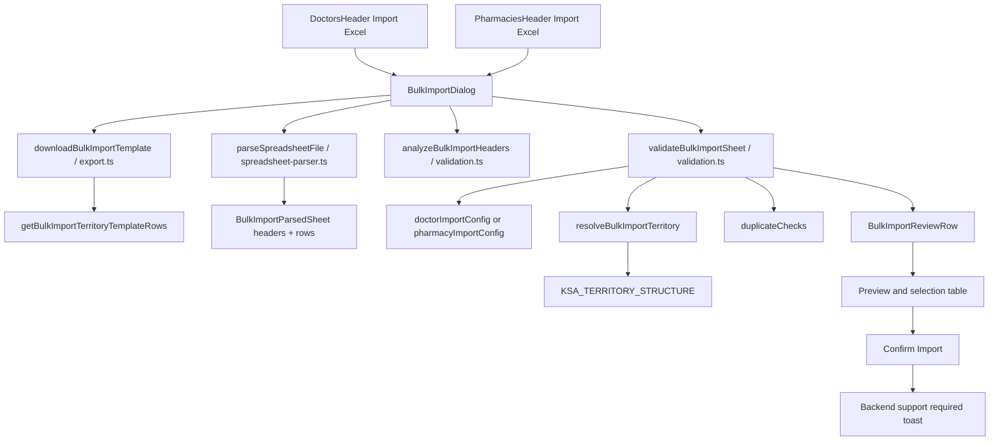
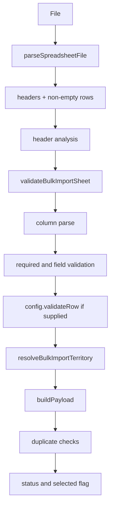
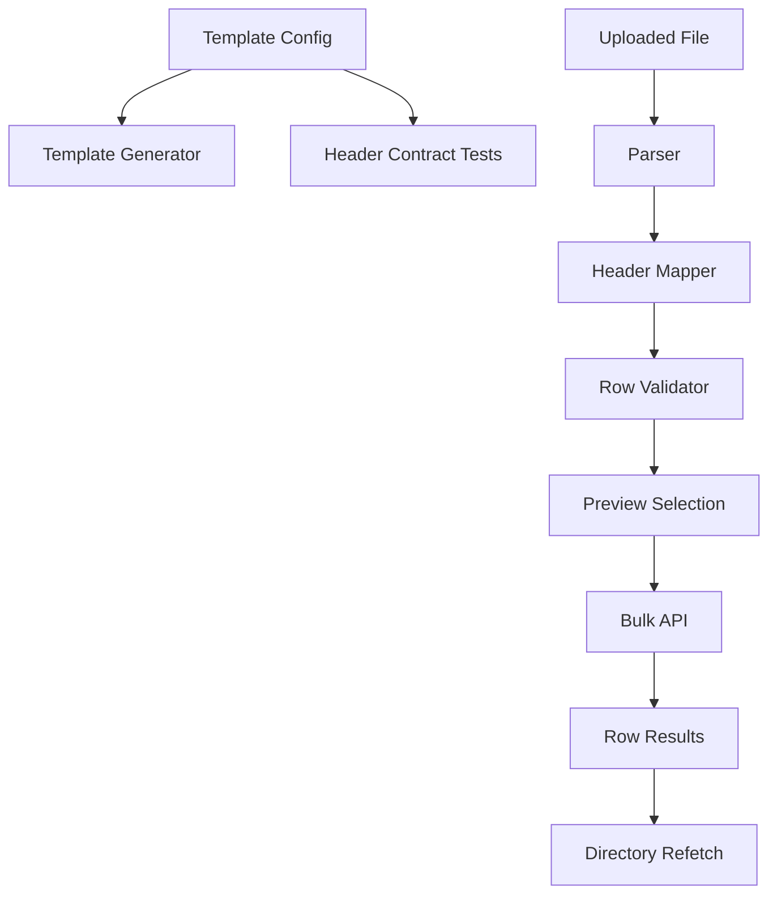

# GolderaPharm Doctors & Pharmacies Bulk Import Audit

> Implementation note: this audit captured the pre-rebuild state. The current
> hardened implementation is documented in `docs/bulk-import-feature.md`.

## 1. Executive Summary

This audit covers the current working copy of `goldFront` as inspected on 2026-09-26. The repository already had uncommitted changes in bulk-import files before this audit began; this document treats those as existing implementation state and does not modify them.

The Doctors and Pharmacies import feature is a shared client-side import review tool. It generates CSV templates, parses uploaded `.csv`, `.tsv`, and `.xlsx` files in the browser, maps headers to configured fields, validates values and territory hierarchy, detects duplicates against loaded directory records and within the uploaded file, previews rows, and lets the manager select eligible rows. Actual persistence is not implemented. `Confirm Import` only shows a backend-support warning.

The current working copy no longer contains the exact legacy error string `"The uploaded file does not contain importable rows."`. That string is visible in the current uncommitted diff as the previous `BulkImportDialog` behavior from `HEAD`: after parsing, it threw the same generic error when either `parsedSheet.rows.length === 0` or `parsedSheet.headers.length === 0`. Current working-copy behavior splits this into clearer header/no-data errors and adds header diagnostics.

Current contract status:

| Area | Doctor | Pharmacy |
|---|---|---|
| Template format | CSV with UTF-8 BOM | CSV with UTF-8 BOM |
| Template/parser headers | PASS in current working copy | PASS in current working copy |
| `.csv` parsing | PASS for UTF-8/UTF-16 and comma/semicolon/tab-like detection; runtime Excel round-trip still recommended | Same |
| `.tsv` parsing | PASS statically | PASS statically |
| `.xlsx` parsing | PARTIAL: first worksheet only, no formula formatting evaluation, depends on browser `DecompressionStream` | Same |
| Bulk persistence | NOT SUPPORTED | NOT SUPPORTED |
| Coordinates import | NOT SUPPORTED | NOT SUPPORTED |

## 2. Scope

Scope included:

- `features/bulk-import/**`
- `features/doctors/**`
- `features/pharmacies/**`
- relevant pages under `app/(dashboard)/manager/**`
- shared geography/territory code
- related API request wrappers and frontend types
- visit location code only as needed for coordinate/proximity impact

No implementation files were changed. This file is the only created file.

## 3. Repository/File Inventory

| File | Entity | Purpose | Calls | Called by | Feature roles |
|---|---|---|---|---|---|
| `features/bulk-import/components/BulkImportDialog.tsx` | Shared | Dialog UI, upload handling, parsing orchestration, validation orchestration, preview, selection, reset, blocked confirm | `parseSpreadsheetFile`, `downloadBulkImportTemplate`, `downloadBulkImportErrorReport`, `analyzeBulkImportHeaders`, `validateBulkImportSheet`, `summarizeBulkImportRows` | `DoctorsHeader`, `PharmaciesHeader` | template download, upload, validation entry, preview, selection, results placeholder, error reporting |
| `features/bulk-import/lib/export.ts` | Shared | CSV creation and browser download | `getBulkImportTerritoryTemplateRows` | `BulkImportDialog` | template generation, error report |
| `features/bulk-import/lib/spreadsheet-parser.ts` | Shared | Browser parser for delimited text and `.xlsx` | browser `File`, `DOMParser`, `DecompressionStream`, `TextDecoder` | `BulkImportDialog` | file parsing, header extraction, row extraction, empty-row filtering |
| `features/bulk-import/lib/validation.ts` | Shared | Header normalization, header analysis, field parsing, validation, duplicate detection, status classification | `resolveBulkImportTerritory` | `BulkImportDialog` | normalization, validation, geography resolution, duplicate detection, classification |
| `features/bulk-import/lib/territory-resolver.ts` | Shared | Converts spreadsheet district/region/territory text to official territory names | `KSA_TERRITORY_STRUCTURE`, `getTerritoryLookup`, `normalizeRegionName`, `normalizeTerritoryName` | `validation.ts`, `export.ts` | geography resolution, template sample rows |
| `features/bulk-import/lib/types.ts` | Shared | Generic import types/config contracts | none | all import modules | type contract |
| `features/doctors/lib/import-config.ts` | Doctors | Doctor import columns, examples, parsing, validation, duplicate checks, payload builder | shared import types | `DoctorsHeader` via `BulkImportDialog` | template headers, field mapping, validation, duplicate checks, payload draft |
| `features/pharmacies/lib/import-config.ts` | Pharmacies | Pharmacy import columns, examples, parsing, duplicate checks, payload builder | shared import types | `PharmaciesHeader` via `BulkImportDialog` | template headers, field mapping, validation, duplicate checks, payload draft |
| `features/doctors/components/DoctorsHeader.tsx` | Doctors | Manager `Import Excel` entry point and existing-record supply | `BulkImportDialog`, `doctorImportConfig` | manager/supervisor/rep doctors pages | button, existing duplicate reference data |
| `features/pharmacies/components/PharmaciesHeader.tsx` | Pharmacies | Manager `Import Excel` entry point and existing-record supply | `BulkImportDialog`, `pharmacyImportConfig` | manager/supervisor/rep pharmacies pages | button, existing duplicate reference data |
| `app/(dashboard)/manager/doctors/page.tsx` | Doctors | Fetches doctors and renders header/list | `getDoctorsAction` | Next route | existing records used for duplicates |
| `app/(dashboard)/manager/pharmacies/page.tsx` | Pharmacies | Fetches all pharmacy pages and renders header/list | `getPharmaciesAction` | Next route | existing records used for duplicates |
| `features/doctors/components/AddDoctorForm.tsx` | Doctors | Single-create form and frontend form schema use | `createDoctorAction` | `AddDoctorDialog`, add page | field contract comparison |
| `features/pharmacies/components/PharmacyForm.tsx` | Pharmacies | Single-create form and frontend form schema use | `createPharmacyAction` | `AddPharmacyDialog` | field contract comparison |
| `features/doctors/api/index.ts` | Doctors | Frontend API wrappers/server actions | `/api/doctors` | doctor forms/pages | single-create/update/fetch contract |
| `features/pharmacies/api/index.ts` | Pharmacies | Frontend API wrappers/server actions | `/api/pharmacies` | pharmacy forms/pages | single-create/fetch contract |
| `features/doctors/lib/types/api.ts` | Doctors | Create/update/response API type | none | doctor feature | API field comparison, coordinates |
| `features/pharmacies/lib/types/index.ts` | Pharmacies | Create/response API type | none | pharmacy feature | API field comparison |
| `features/plan/lib/territory.ts` | Shared geography | Static KSA hierarchy and alias normalization | none | import resolver, forms, lists | geography source |
| `features/doctors/lib/utils/mappers.ts` | Doctors | Maps API doctors to directory/profile data | `getTerritoryLookup` | doctors list/profile | display fields, coordinates |
| `features/pharmacies/lib/utils/directory.ts` | Pharmacies | Normalizes API pharmacies for directory and details | `getTerritoryLookup` | pharmacy list | display fields |

## 4. Architecture



There is no separate service layer for bulk import persistence. The shared engine is generic and entity-specific behavior is supplied by the config object.

## 5. Doctor Import Flow

Current implementation:

1. Manager page fetches doctors through `getDoctorsAction(undefined, undefined, undefined, false)`.
2. `DoctorsHeader` renders `Import Excel` only for managers.
3. Clicking opens `BulkImportDialog<DoctorApiResponse, DoctorImportPayload>` with `existingRecords={doctors}` and `config={doctorImportConfig}`.
4. `Template` calls `downloadBulkImportTemplate(config)`.
5. The downloaded file is named `golderapharm-doctors-import-template.csv`.
6. Template content is generated from `doctorImportConfig.columns`, with up to three sample rows from the static territory hierarchy.
7. `Upload File` opens a hidden file input accepting `.xlsx,.csv,.tsv`.
8. `handleFile()` calls `parseSpreadsheetFile(file)`.
9. Parser returns `headers` and non-empty `rows`.
10. Current working copy rejects files with no headers using `"The uploaded file does not contain a header row."`.
11. Current working copy runs `analyzeBulkImportHeaders()` and rejects missing required headers with a specific `"Missing required column(s)"` message.
12. Current working copy rejects files with headers but no rows using `"The uploaded file has headers but no data rows..."`.
13. `validateBulkImportSheet()` builds a normalized header map.
14. Each configured doctor column is read by label, key, or aliases.
15. Column `parse` functions trim, normalize grade, parse numbers, or return `undefined` for optional blanks.
16. Required and field-level validations run.
17. `resolveBulkImportTerritory()` checks district, region, and territory against the static hierarchy.
18. `doctorImportConfig.buildPayload()` creates a draft `CreateDoctorDto` plus spreadsheet-only `district` and `region`, or returns `null`.
19. Duplicate checks compare phone, license number, and email against existing loaded doctors and within the uploaded file.
20. Status becomes `ready`, `warning`, or `invalid`.
21. Current working copy auto-selects `ready` and `warning` rows; invalid rows are locked.
22. `Confirm Import` does not call an API. It sets `commitBlocked` and shows `"Backend support required"`.
23. Directory is not refreshed after confirm because no persistence occurs.

## 6. Pharmacy Import Flow

Current implementation:

1. Manager page fetches pharmacy pages through `getPharmaciesAction`.
2. `PharmaciesHeader` renders `Import Excel` only for managers.
3. Clicking opens `BulkImportDialog<PharmacyApiResponse, PharmacyImportPayload>` with `existingRecords={pharmacies}` and `config={pharmacyImportConfig}`.
4. Template download, upload, parse, header analysis, validation, territory resolution, preview, selection, and confirm use the same shared dialog.
5. Pharmacy-specific columns are `Pharmacy Name`, `City`, `Country`, `District`, `Region`, `Territory`.
6. Duplicate detection uses pharmacy name only.
7. `Confirm Import` is blocked exactly like Doctors and does not call `/api/pharmacies`.

## 7. Template Generation

Shared generator:

- File format: CSV text, not XLSX.
- MIME type: `text/csv;charset=utf-8`.
- Browser download: creates a `Blob`, prepends `\uFEFF`, creates an object URL, appends/clicks/removes an `<a>`, then revokes the URL.
- BOM: yes, UTF-8 BOM is prepended.
- Line endings: `\r\n`.
- Quoting: CSV cells containing `"`, comma, CR, or LF are quoted; quotes are doubled.
- Sample rows: first three territory rows from `KSA_TERRITORY_STRUCTURE`.
- UI wording: button says `Import Excel`; helper text says templates download as CSV and open in Excel.

Exact Doctor generated headers:

```text
English Name,Arabic Name,Phone,Email,Specialty,Grade,License Number,Avg Patients Per Day,Account / Facility,District,Region,Territory
```

Doctor required fields in template/config:

- `English Name`
- `Arabic Name`
- `Phone`
- `Specialty`
- `Grade`
- `Account / Facility`
- `District`
- `Region`
- `Territory`

Doctor optional fields:

- `Email`
- `License Number`
- `Avg Patients Per Day`

Exact Pharmacy generated headers:

```text
Pharmacy Name,City,Country,District,Region,Territory
```

Pharmacy required fields:

- `Pharmacy Name`
- `City`
- `Country`
- `District`
- `Region`
- `Territory`

## 8. Parsing

### CSV

Current working-copy support: yes.

Code path:

- `parseSpreadsheetFile()`
- identifies CSV by `.csv`, `.txt`, MIME `text/csv`, `application/csv`, or `application/vnd.ms-excel`
- `readTextFile()` decodes UTF-16LE, UTF-16BE, otherwise UTF-8
- `detectDelimiter()` scores comma, semicolon, and tab outside quotes
- `parseDelimitedText()`
- `rowsToSheet()`

Cells are trimmed and BOM characters are removed by `cleanCell()`. Quoted CSV values are supported, including escaped double quotes. Numbers stay strings at parser level and are converted by entity column parsers later. Phone numbers stay strings.

### TSV

Current working-copy support: yes.

Code path:

- `.tsv` or `text/tab-separated-values`
- `readTextFile()`
- `parseDelimitedText(text, "\t", file.name)`

### XLSX

Current working-copy support: partial.

Code path:

- `.xlsx` or XLSX MIME
- custom ZIP central-directory reader
- first workbook worksheet only
- XML parser via `DOMParser`
- shared strings and inline strings supported
- numeric cells read from raw `<v>` text
- formulas are not evaluated by this parser; cached values may be read if present as normal `<v>` values
- depends on browser `DecompressionStream` for compressed XLSX entries

### Empty Row Handling

`rowsToSheet()` finds the first row containing any non-empty cell and treats it as the header row. Rows after that are converted to objects keyed by headers and filtered out only if every mapped value is empty after trimming/BOM removal. Partially populated rows are retained.

## 9. Header Mapping

Current header normalization:

```text
remove BOM -> trim -> lowercase -> normalize spaces around "/" -> collapse whitespace -> remove all non a-z/0-9
```

Observed outcomes from code:

| Header | Recognized as expected? | Reason |
|---|---:|---|
| `English Name` | Yes | normalizes to `englishname` |
| ` English Name ` | Yes | trim |
| `english name` | Yes | lowercase |
| `Account / Facility` | Yes | config label |
| `Account/Facility` | Yes | slash spacing normalization then punctuation removal |
| `Account / Facility ` | Yes | trim |
| `Avg Patients Per Day` | Yes | config label |
| `Avg. Patients Per Day` | No, unless alias added | `avgpatientsperday` vs `avgpatientsperday`? Actually punctuation removal makes both equivalent, so current code recognizes it. |
| `\uFEFFEnglish Name` | Yes | BOM removed |

The previous `HEAD` implementation only did trim/lowercase/remove non-alphanumeric. It did not explicitly remove BOM before validation, but because the non-alphanumeric removal also removes U+FEFF, validation header matching was still likely tolerant. The parser itself also removed BOM from cells.

## 10. Data Models

### Doctor Business Fields

| Field | Required | Add Form | Edit/Profile | API Type | Importable | Submitted by Import Payload |
|---|---:|---:|---:|---:|---:|---:|
| `nameEN` / English Name | Yes | Yes | Yes | Yes | Yes | Yes |
| `nameAR` / Arabic Name | Yes | Yes | Yes | Yes | Yes | Yes |
| `phone` | Yes | Yes | Yes | Yes | Yes | Yes |
| `email` | No | Yes | Yes | Yes | Yes | Yes when present |
| `specialty` | Yes | Yes | Yes | Yes | Yes | Yes |
| `grade` | Yes | Yes | Yes | Yes | Yes | Yes |
| `LicenseNumber` | No | Form uses `license`, payload maps to `LicenseNumber` | Yes | Yes | Yes | Yes when present |
| `avgPatientsPerDay` | No | Form uses `avgPatients`, payload maps to `avgPatientsPerDay` | Yes | Yes | Yes | Yes when numeric |
| `accountName` | Yes | Yes | Yes | Yes | Yes | Yes |
| `subRegion` / Territory | Yes | Yes | Yes | Yes | Yes | Yes as resolved official territory |
| `area` | No | No | editable internal state only | Yes | No | No |
| `latitude` | No | No | internal editable state, no visible inputs found | Yes | No | No |
| `longitude` | No | No | internal editable state, no visible inputs found | Yes | No | No |
| `district` | Spreadsheet-only | UI select state, not API DTO | Display derived from territory | No in response type | Yes | Present in import payload type but not `CreateDoctorDto` |
| `region` | Spreadsheet-only | UI select state, not API DTO | Display derived from territory | No in doctor response type | Yes | Present in import payload type but not `CreateDoctorDto` |

### Pharmacy Business Fields

| Field | Required | Add Form | Directory/Details | API Type | Importable | Submitted by Import Payload |
|---|---:|---:|---:|---:|---:|---:|
| `name` / Pharmacy Name | Yes | Yes | Yes | Yes | Yes | Yes |
| `city` | Yes | Yes | Yes | Yes | Yes | Yes |
| `country` | Yes | Yes | Yes | Yes | Yes | Yes |
| `subRegion` / Territory | Yes | Yes | Yes | Yes | Yes | Yes |
| `region` | Yes | Yes | Yes | Yes | Yes | Yes |
| `district` | Spreadsheet-only | UI select state, not DTO | Derived from `subRegion` | No | Yes | Present in import payload type but not `CreatePharmacyDto` |
| `latitude` | No | No | No | No | No | No |
| `longitude` | No | No | No | No | No | No |

## 11. Doctor Field Matrix

| Business Field | Add Form | Template | Parser | Validator | Preview | API |
|---|---|---|---|---|---|---|
| English Name | `nameEN` | `English Name` | label/key/aliases | required | shown | `nameEN` |
| Arabic Name | `nameAR` | `Arabic Name` | label/key/aliases | required | shown | `nameAR` |
| Phone | `phone` | `Phone` | label/key/aliases | required + regex | shown | `phone` |
| Email | `email` | `Email` | label/key/aliases | email regex if present | shown | `email?` |
| Specialty | `specialty` | `Specialty` | label/key | required | shown | `specialty` |
| Grade | `grade` | `Grade` | label/key | required + A/B/C/D | shown | `grade` |
| License Number | form `license` -> DTO `LicenseNumber` | `License Number` | label/key/aliases | none | shown | `LicenseNumber?` |
| Avg Patients Per Day | form `avgPatients` -> DTO `avgPatientsPerDay` | `Avg Patients Per Day` | label/key/aliases | number >= 0 if present | shown | `avgPatientsPerDay?` |
| Account / Facility | `accountName` | `Account / Facility` | label/key/aliases | required | shown | `accountName` |
| District | select state only | `District` | label/key | required + hierarchy check | after first 7 not in table columns, territory chip visible | not in `CreateDoctorDto` |
| Region | select state only | `Region` | label/key | required + hierarchy check | territory chip visible | not in doctor response type |
| Territory | `subRegion` | `Territory` | label/key/aliases | required + official territory lookup | territory chip visible | `subRegion` |
| Latitude | no input | missing | not parsed | not validated | not shown | type supports but importer omits |
| Longitude | no input | missing | not parsed | not validated | not shown | type supports but importer omits |

## 12. Pharmacy Field Matrix

| Business Field | Add Form | Template | Parser | Validator | Preview | API |
|---|---|---|---|---|---|---|
| Pharmacy Name | `name` | `Pharmacy Name` | label/key/aliases | required | shown | `name` |
| City | `city` | `City` | label/key | required | shown | `city` |
| Country | `country` | `Country` | label/key | required; parser defaults blank to Saudi Arabia but required check sees parsed default | shown | `country` |
| District | select state only | `District` | label/key | required + hierarchy check | shown in territory chip | not in `CreatePharmacyDto` |
| Region | `region` | `Region` | label/key | required + hierarchy check | shown | `region` |
| Territory | `subRegion` | `Territory` | label/key/aliases | required + official territory lookup | shown | `subRegion` |
| Latitude | no input | missing | not parsed | not validated | not shown | no type support |
| Longitude | no input | missing | not parsed | not validated | not shown | no type support |

## 13. Validation Pipeline

Shared execution order:



Status rules:

- `invalid`: any issue with `severity: "error"`.
- `warning`: no errors and at least one warning.
- `ready`: no issues.

Current working-copy selection rules:

- `ready`: selected automatically.
- `warning`: selected automatically.
- `invalid`: not selected and cannot be selected.

Previous `HEAD` selected only `ready` rows automatically.

## 14. Territory Resolution

Geography data comes from `features/plan/lib/territory.ts`, not from an API call. The static hierarchy is:

- `Central & Eastern District`
  - `Central Region`: `Riyadh 1`, `Riyadh 2`
  - `Eastern Region`: `Eastern 1`, `Eastern 2`
- `Western & Southern District`
  - `Western Region`: `Jeddah 1`, `Jeddah 2`, `Makkah / Taif`, `Madinah`
  - `Southern Region`: `Southern Area`

Matching:

- Territory uses `normalizeTerritoryName()` and alias lookup in `features/plan/lib/territory.ts`.
- Region uses `normalizeRegionName()` aliases.
- District uses local aliases in `territory-resolver.ts`.
- Matching trims, lowercases, normalizes `&` to `and`, normalizes underscores/hyphens, normalizes slash spacing, and collapses whitespace.

Validation:

- Territory is required and must be known.
- Region, if present, must be known and match the territory's official region.
- District, if present, must be known and match the territory's official district.
- Spreadsheet cannot create geography.
- Submitted payload uses official labels, not raw spreadsheet labels.

This prevents accidental wrong-territory assignment when the district or region contradicts the territory; the row becomes invalid.

## 15. Latitude / Longitude

Doctors:

| Question | Answer |
|---|---|
| A. Shown in Add form? | No |
| B. In frontend schema? | No add-form schema fields |
| C. In frontend type? | Yes, `CreateDoctorDto`, `UpdateDoctorDto`, and `DoctorApiResponse` include `latitude` and `longitude` |
| D. In import template? | No |
| E. Parsed? | No |
| F. Validated? | No |
| G. Sent to API by import? | No |
| H. API response returns it? | Frontend type expects nullable `latitude` and `longitude` |
| I. Displayed in profile/details? | Not as visible coordinates in inspected profile UI |
| J. Actually persisted? | Not statically provable from frontend alone |

Pharmacies:

| Question | Answer |
|---|---|
| A. Shown in Add form? | No |
| B. In frontend schema? | No |
| C. In frontend type? | No |
| D. In import template? | No |
| E. Parsed? | No |
| F. Validated? | No |
| G. Sent to API? | No |
| H. API response returns it? | No frontend type support |
| I. Displayed in profile/details? | No |
| J. Actually persisted? | No frontend evidence |

Visit completion location captures the rep/device location. This audit did not find frontend evidence that visit proximity can obtain target doctor/pharmacy coordinates from the current pharmacy data, and doctor coordinates are not importable. Coordinate integration requires backend/API contract verification and likely backend change; it is excluded from this frontend-only import scope.

## 16. Duplicate Detection

Doctors:

- Existing-record warnings: phone, license number, email.
- In-file duplicate errors: phone, license number, email.
- Normalization: trim, lowercase, collapse whitespace.
- Empty duplicate values are ignored.
- Existing duplicates are warnings, so current working-copy behavior selects those rows by default.
- In-file duplicates are errors, so rows become invalid and locked.

Pharmacies:

- Existing-record warnings: pharmacy name.
- In-file duplicate errors: pharmacy name.
- Same normalization as Doctors.

Risks:

- Doctor duplicate checks do not normalize phone punctuation beyond whitespace/case, so `+966 50 123 4567` and `+966501234567` are false negatives.
- Pharmacy duplicate check by name only can false-positive chain branches with identical names but distinct city/territory.
- Existing duplicate warnings being selected by default can create duplicate-risk if backend does not enforce uniqueness.

## 17. Preview & Selection

Current behavior:

- Preview appears only when `rows.length > 0`.
- Desktop table shows row number, status, the first seven configured columns, and issues.
- Mobile row shows payload label, status, territory chip, issues, and checkbox.
- `Select eligible visible rows` acts on currently filtered/search-visible rows only.
- Invalid rows cannot be selected.
- Manager can deselect ready/warning rows.
- Selected count is derived from row `selected` flags and therefore represents actual rows the UI would try to import if persistence existed.
- Search uses payload label, resolved territory fields, and all source cell values.
- Re-uploading a new file overwrites `sheet` and `rows`; parse errors clear both.
- `commitBlocked` resets on upload and selection changes.
- Reset clears `sheet`, `rows`, `search`, `filter`, `parseError`, and `commitBlocked`.
- The file input DOM value is cleared after every upload attempt in `finally`, so uploading the same file again works after a parse attempt. Reset itself does not touch the input, but the input was already cleared by upload completion.

## 18. Confirm Import & Persistence

Actual function chain:

```text
Confirm Import button
  -> handleConfirmImport()
  -> if commitBlocked return
  -> setCommitBlocked(true)
  -> toast.warning({ title: "Backend support required", description: BACKEND_SUPPORT_MESSAGE })
```

It does not:

- call a bulk endpoint
- loop over `/api/doctors`
- loop over `/api/pharmacies`
- write localStorage
- mutate browser state into the directory
- refresh data
- produce real results

This is an intentional blocker in current code, but the UI still has a `Confirm Import` button and a stepper with `Results`, which can read as more complete than it is.

## 19. API Analysis

Doctors:

- Existing frontend fetch endpoint: `GET /api/doctors` with optional query params.
- Existing create endpoint wrapper: `POST /api/doctors`.
- Existing update endpoint wrapper: `PATCH /api/doctors/:id`.
- No frontend bulk doctor endpoint is used by the importer.
- No repeated single-create behavior exists in the importer.

Pharmacies:

- Existing fetch endpoint: `GET /api/pharmacies?page=&limit=`.
- Existing create endpoint wrapper: `POST /api/pharmacies`.
- No frontend bulk pharmacy endpoint is used by the importer.
- No repeated single-create behavior exists in the importer.

Bulk API support from current frontend consumption: NOT SUPPORTED.

## 20. Error Handling

| Condition | Current user message | Accuracy | Data preserved? |
|---|---|---|---|
| Unsupported extension/MIME | `Unsupported file type. Upload a .csv, .tsv, or .xlsx file.` | Accurate | No, rows cleared |
| Unreadable XLSX ZIP | `This .xlsx file could not be read.` or more specific XLSX parser error | Generally accurate | No |
| Browser lacks `DecompressionStream` | `This browser cannot read compressed .xlsx files. Save the template as CSV and try again.` | Accurate | No |
| No readable worksheet | `The workbook does not contain a readable first worksheet.` | Accurate | No |
| No header row | `The uploaded file does not contain a header row.` | Accurate | No |
| Missing required headers | `Missing required column(s): ...` | Accurate | No |
| Headers but no data rows | `The uploaded file has headers but no data rows...` | Accurate | No |
| Required field blank | `<Column> is required.` | Accurate at row level | Yes in preview |
| Invalid email | `Enter a valid email address.` | Accurate | Yes |
| Invalid phone | `Enter a valid phone number.` | Accurate | Yes |
| Invalid grade | `Grade must be A, B, C, or D.` | Accurate | Yes |
| Invalid average patients | `Average patients must be 0 or greater.` | Accurate | Yes |
| Unknown territory | `Unknown territory "...". Use an official territory from the template.` | Accurate | Yes |
| Region mismatch | `Region "..." does not match territory "...".` | Accurate | Yes |
| District mismatch | `District "..." does not match territory "...".` | Accurate | Yes |
| Existing duplicate | `<Field> already exists in CRM: ...` | Warning; may still be selected | Yes |
| In-file duplicate | `<Field> is duplicated in this file on rows ...` | Accurate | Yes |
| Confirm import | `Backend support required` | Accurate | Yes |
| Network/API error | Not applicable because confirm does not call API | N/A | N/A |

Legacy error:

- Previous code threw `"The uploaded file does not contain importable rows."` when headers OR rows were empty.
- That message was generic and could conflate an empty sheet, missing header, parser failure resulting in no rows, or a header-only file.

## 21. UI State Machine

| Step | Entry condition | State variables | Allowed actions | Exit condition / behavior |
|---|---|---|---|---|
| 01 Upload | dialog open | `sheet=null`, `rows=[]`, `parseError=""` | Template, upload | file chosen |
| 02 Validate | `handleFile` running | `isParsing=true` | none except disabled upload | success sets sheet/rows; error clears sheet/rows and sets parseError |
| 03 Preview / Resolve | `rows.length > 0` | `rows`, `filter`, `search`, `summary` | filter, search, row select, visible select, error report, reset | confirm or reset/reupload |
| 04 Confirm Import | `summary.selected > 0` and not `commitBlocked` | `commitBlocked=false` | click confirm | sets `commitBlocked=true`; no persistence |
| 05 Results | never reached as real results | no results object exists | none | impossible in current implementation |

Impossible/misleading states:

- Stepper can mark `Confirm Import` complete through `commitBlocked`, even though nothing was imported.
- `Results` step exists visually but has no implementation.
- Confirm button is available for selected warning rows, including existing duplicate warnings.

## 22. Reset / Re-upload Behavior

Reset clears:

- selected sheet
- parsed/review rows
- search
- filter
- parse error
- commit blocked state

Reset does not explicitly clear:

- file input DOM value

However, `handleFile()` clears the file input in `finally`, so after any upload attempt the same file can be selected again. If Reset is pressed before any file selection completes, there is no pending same-file issue visible in the code.

## 23. Encoding / Arabic / Excel Compatibility

Download template:

- Uses UTF-8 text with BOM.
- This is the correct static signal for Windows Excel to open Arabic CSV more safely than UTF-8 without BOM.

Upload parser:

- Current working copy decodes UTF-16LE/UTF-16BE BOMs and otherwise UTF-8.
- It strips BOM characters from cells.
- It supports comma, semicolon, and tab delimiter detection for CSV-like text.

Arabic:

- Parser treats text as JavaScript strings and does not transform Arabic characters.
- Static code indicates UTF-8 BOM download plus UTF-16 upload support should preserve Arabic in common Excel round trips.
- Requires runtime round-trip test because actual Excel save behavior depends on Windows Excel version, chosen Save/Save As format, locale delimiter, and browser `File` metadata.

## 24. Security & Data Integrity

Confirmed:

- Spreadsheet values are rendered as React text, not `dangerouslySetInnerHTML`; HTML/script cells should be escaped by React.
- No localStorage persistence or client-only fake record creation was found.
- Confirm does not send fabricated IDs or coordinates because it sends nothing.
- File size and row count are unbounded in the parser/UI.
- Existing duplicate warnings can remain selected.
- Error diagnostics log header details to console in current working copy when required headers are missing; this may expose uploaded header names but not full row data.

Risks:

- Huge files can consume memory because parsing builds full arrays and preview renders all visible rows.
- No double-submit API risk exists now because no API call exists; if persistence is added, commit blocking should remain.
- Unsupported spreadsheet columns are silently ignored after header analysis except listed as unknown internally; UI does not show unknown headers to the user.

## 25. Performance

Expected behavior:

| Rows | Risk |
|---:|---|
| 10 | Fine |
| 100 | Fine |
| 500 | Likely acceptable but full React table rendering begins to matter |
| 1,000 | Possible UI lag; duplicate checks and rendering are still in-memory/client-side |
| 5,000 | Browser freeze risk from parsing, validation, duplicate maps, and rendering all preview rows |

Algorithmic notes:

- Duplicate checks use maps and are roughly O(n) per duplicate field.
- Territory resolution scans small static arrays and is effectively constant for the current hierarchy.
- Rendering is not virtualized.
- XLSX parsing loads the entire file into memory.

## 26. Round-Trip Contract

Doctor:

| Arrow | Status | Evidence |
|---|---|---|
| Generate template | PASS | CSV generator uses config columns and territory rows |
| Fill template | PASS | Required columns align with config |
| Save | UNVERIFIED | Excel behavior requires runtime test |
| Upload | PASS statically | accepts `.xlsx,.csv,.tsv` |
| Parse | PASS for text; PARTIAL for XLSX | custom parser limitations |
| Validate | PASS | required/field/geography/duplicate rules present |
| Preview | PASS | rows render with status/issues |
| Confirm | FAIL | backend support warning only |
| Persist | FAIL | no API call |
| Refetch | FAIL | no persistence/refetch |
| Visible in directory | FAIL | no records created |

Pharmacy:

| Arrow | Status | Evidence |
|---|---|---|
| Generate template | PASS | CSV generator uses config columns and territory rows |
| Fill template | PASS | Required columns align with config |
| Save | UNVERIFIED | Excel behavior requires runtime test |
| Upload | PASS statically | accepts `.xlsx,.csv,.tsv` |
| Parse | PASS for text; PARTIAL for XLSX | custom parser limitations |
| Validate | PASS | required/geography/duplicate rules present |
| Preview | PASS | rows render with status/issues |
| Confirm | FAIL | backend support warning only |
| Persist | FAIL | no API call |
| Refetch | FAIL | no persistence/refetch |
| Visible in directory | FAIL | no records created |

## 27. Confirmed Bugs

| ID | Severity | Entity | Problem | Root Cause | Evidence | Recommended Fix |
|---|---|---|---|---|---|---|
| BI-001 | P1 | Both | Bulk import cannot persist records | `handleConfirmImport()` only sets `commitBlocked` and shows backend warning | `BulkImportDialog.tsx` confirm chain | BACKEND REQUIRED: add real endpoint or explicitly remove/disable commit workflow until available |
| BI-002 | P2 | Both | UI implies a complete import flow with `Confirm Import` and `Results`, but results never occur | Stepper and button exist without persistence/result state | `BulkImportDialog.tsx` | FRONTEND FIX after backend decision: add true results state or relabel as validation-only |
| BI-003 | P2 | Both | Existing-CRM duplicate warning rows are selected by default in current working copy | `selected: status !== "invalid"` includes warnings | `validation.ts` | FRONTEND FIX: decide duplicate warning policy; likely deselect existing duplicates by default |
| BI-004 | P2 | Both | Parser/UI has no file size or row count limit | full file loaded and all rows rendered | `spreadsheet-parser.ts`, dialog table | FRONTEND FIX: enforce max rows/size and add virtualized preview if needed |
| BI-005 | P3 | Both | Unknown extra columns are not surfaced to users | header analysis computes unknown headers but only logs diagnostics on missing required headers | `analyzeBulkImportHeaders()` | FRONTEND FIX: show non-blocking unknown column warning |
| BI-006 | P3 | Pharmacy | Duplicate detection by pharmacy name only may false-positive separate branches | duplicate check uses only `name` | `pharmacyImportConfig` | FRONTEND FIX / PRODUCT DECISION: use name + city + territory or backend uniqueness rule |
| BI-007 | P3 | Doctor | Phone duplicate normalization may false-negative punctuation variants | duplicate normalization collapses whitespace only | `validation.ts` | FRONTEND FIX: normalize phone digits/country prefix consistently with backend |

No confirmed P0 issues were found.

## 28. Risks Requiring Runtime Verification

- Windows Excel round trip for Doctor CSV with Arabic values.
- Windows Excel round trip for semicolon-delimited locales.
- `.xlsx` upload generated by Excel from the downloaded template.
- Browser support for `DecompressionStream` in target browsers.
- Backend persistence of doctor latitude/longitude, because frontend types include them but no import UI uses them.
- Whether backend uniqueness constraints match frontend duplicate warnings.

Runtime browser verification was not performed in this session.

## 29. Backend Dependencies

Backend-required work:

- Real doctor bulk import persistence.
- Real pharmacy bulk import persistence.
- Transaction/partial-failure behavior definition.
- Backend validation response contract for row-level errors.
- Duplicate/uniqueness contract.
- Coordinate persistence/import contract if Doctors or Pharmacies need target proximity.

Frontend-only work can improve parsing, validation, messaging, selection, and test coverage, but cannot make the feature create records without backend/API support.

## 30. Recommended Architecture

Recommended target:



Keep shared code for parser, header normalization, CSV export, row review UI, and duplicate framework. Keep entity-specific config for columns, payload rules, and duplicate policy. Add contract tests that generate each template and immediately parse/validate it.

## 31. Recommended Fix Order

Phase 1 - Stabilize documented current changes: FRONTEND FIX

- Preserve explicit no-header/no-data/missing-column errors.
- Add tests for generated template headers against parser and validator.

Phase 2 - Parser/header hardening: FRONTEND FIX

- Add explicit row/file size limits.
- Surface unknown columns as warnings.
- Runtime-test CSV UTF-8, CSV UTF-16, semicolon CSV, TSV, and XLSX from Excel.

Phase 3 - Selection/duplicate policy: FRONTEND FIX

- Decide whether warning rows should auto-select.
- Consider existing duplicate warnings deselected by default.

Phase 4 - Persistence contract: BACKEND REQUIRED

- Define `/api/doctors/bulk-import` and `/api/pharmacies/bulk-import`, or define controlled sequential single-create behavior.
- Include row-level success/failure and idempotency/duplicate behavior.

Phase 5 - Results/refetch: FRONTEND FIX after backend

- Implement results state.
- Refresh directory after successful import.
- Preserve failed rows and export result/error report.

Phase 6 - Coordinates: BACKEND REQUIRED + FRONTEND FIX

- Decide coordinate fields for doctors/pharmacies.
- Add template columns, validation, API contract, and display only after backend persistence is confirmed.

Phase 7 - Regression tests: FRONTEND FIX

- Unit/contract tests for template -> parser -> validator.
- Header alias/normalization tests.
- Territory mismatch tests.
- Duplicate tests.
- Browser E2E for upload/preview once tooling exists.

## 32. Test Plan

Recommended tests:

- Doctor generated template parses with all headers.
- Pharmacy generated template parses with all headers.
- Header normalization recognizes whitespace, case, slash spacing, punctuation, and BOM variants.
- CSV quoted commas and quotes parse correctly.
- CSV semicolon detection works.
- TSV parsing works.
- UTF-16LE and UTF-16BE text files decode.
- XLSX first worksheet parses shared strings, inline strings, and numeric values.
- Empty trailing rows are ignored.
- Partially populated rows are retained and marked invalid, not dropped.
- Doctor required fields and validators.
- Pharmacy required fields.
- Territory unknown/mismatch cases.
- In-file duplicate errors and existing-record warnings.
- Reset/re-upload same file.
- Confirm import blocked until backend support exists, or real persistence once backend exists.

Existing test audit:

- No bulk-import test files were found.
- One app-local dashboard test file exists at `features/dashboard/components/manager/_tests/dashboard.test.cjs`.
- There is no `test` script in `package.json`.

## 33. Final Assessment

The import review layer is coherent and mostly well-factored around a shared config-driven engine. In the current working copy, the template/parser/header contract for Doctors and Pharmacies is statically sound, and several improvements already exist over `HEAD`: clearer empty-file errors, missing required header diagnostics, UTF-16 decoding, delimiter detection, CSV MIME handling, and warning-row selection changes.

The major product gap is not parsing; it is persistence. The feature currently validates and previews imports but cannot create Doctors or Pharmacies. The most important next implementation task is to define and implement the backend bulk import contract, then wire `Confirm Import` to real row-level results.

The historical `"The uploaded file does not contain importable rows."` failure came from the previous generic post-parse guard: if the parser produced no headers or no non-empty rows, the dialog showed that same message. The current working copy has already split this into distinct header/no-data errors, but runtime Excel round-trip testing is still required to confirm the exact user reproduction path for Windows Excel saves.
