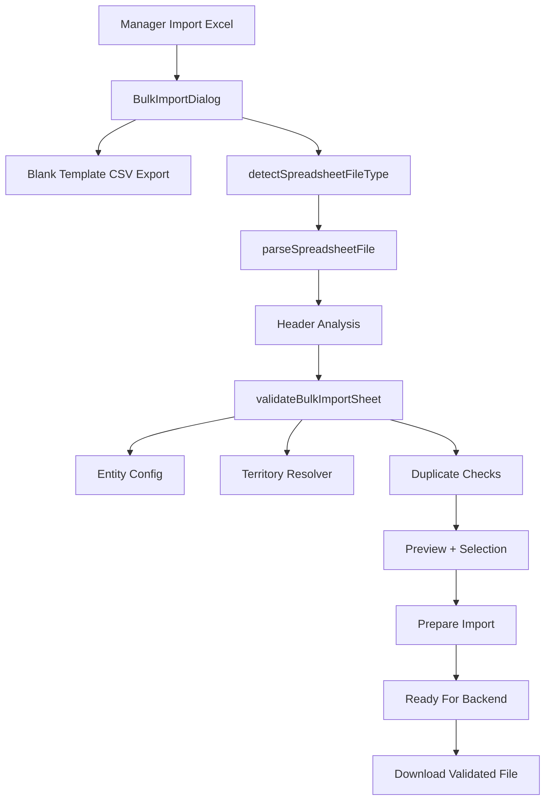

# GolderaPharm Bulk Import Feature

## Current Status

Doctors and Pharmacies use one shared frontend bulk-import engine. The engine supports template download, browser parsing, header mapping, validation, territory resolution, duplicate detection, preview, selection, error-report export, and validated-batch export.

Database persistence is not implemented because no verified frontend bulk-create endpoint exists for Doctors or Pharmacies. Preparing a batch produces an honest frontend completion state:

> The frontend validation and import preparation are complete. Database persistence will become available when the bulk-import backend endpoint is connected.

Requires backend change - excluded from current frontend-only scope.

## Architecture

Shared files:

- `features/bulk-import/components/BulkImportDialog.tsx`
- `features/bulk-import/lib/spreadsheet-parser.ts`
- `features/bulk-import/lib/validation.ts`
- `features/bulk-import/lib/territory-resolver.ts`
- `features/bulk-import/lib/export.ts`
- `features/bulk-import/lib/types.ts`

Entity configs:

- `features/doctors/lib/import-config.ts`
- `features/pharmacies/lib/import-config.ts`

## Five-Stage Workflow

1. Upload
2. Validate
3. Preview / Resolve
4. Prepare Import
5. Ready to Import

Without backend bulk persistence, Stage 05 means `Import file prepared`, not imported. The manager can download a validated file containing only selected Ready/Warning rows.

## Supported Formats

Advertised input formats:

- `.xlsx`
- `.csv`
- `.tsv`
- delimited `.txt`

Legacy `.xls` workbooks are detected by file signature, but the current frontend has no safe installed parser for them. Users are told to save as `.xlsx`, `.csv`, `.tsv`, or delimited `.txt`.

CSV/TSV/TXT are parsed directly in the browser. Text uploads support UTF-8, UTF-16LE BOM, and UTF-16BE BOM. Delimiter detection supports comma, semicolon, and tab outside quotes.

XLSX parsing uses content detection instead of trusting the extension. The parser reads the first worksheet, shared strings, inline strings, numeric cell values, and compressed ZIP entries when the browser supports `DecompressionStream`.

Extension/content mismatch handling:

- XLSX bytes renamed `.csv`: detected and parsed as XLSX with a warning.
- CSV/TSV text renamed `.xlsx`: detected and parsed as delimited text with a warning.
- TSV text renamed `.csv`: detected and parsed as TSV with a warning.
- Unsupported binaries: rejected before header validation.

Limits:

- 10 MB max file size
- 1,000 parsed data rows per batch

## Encoding

All generated CSV downloads are prefixed with UTF-8 BOM:

- Doctor blank template
- Pharmacy blank template
- error report
- validated batch

CSV escaping handles commas, quotes, CR/LF, and Arabic text.

Templates are header-only. They do not contain fake doctors or pharmacies, so an unchanged application-generated template cannot fail duplicate validation because of contradictory sample rows.

## Header Mapping

Header comparison:

- removes UTF BOM
- trims whitespace
- lowercases
- normalizes spaces around `/`
- collapses repeated whitespace
- removes non-alphanumeric characters

Supported examples:

- `English Name`
- ` english name `
- `\uFEFFEnglish Name`
- `Account / Facility`
- `Account/Facility`
- `Avg. Patients Per Day`

Required missing columns produce exact missing-column errors. Extra columns do not block import; the dialog warns that they will be ignored.

## Doctor Schema

Template fields:

| Field | Required | Notes |
|---|---:|---|
| English Name | Yes | `nameEN` |
| Arabic Name | Yes | `nameAR` |
| Phone | Yes | Existing phone rule |
| Email | No | Email rule when present |
| Specialty | Yes | String |
| Grade | Yes | A, B, C, D; also accepts `Grade A` |
| License Number | No | `LicenseNumber` |
| Avg Patients Per Day | No | finite number >= 0 |
| Account / Facility | Yes | `accountName` |
| District | Yes | official hierarchy label |
| Region | Yes | official hierarchy label |
| Territory | Yes | official hierarchy label, mapped to `subRegion` |
| Latitude | No | Doctor DTO supports it |
| Longitude | No | Doctor DTO supports it |

Coordinate rules:

- both absent: allowed
- both present: finite values required
- latitude: -90 to 90
- longitude: -180 to 180
- latitude only: invalid
- longitude only: invalid
- `0` is valid and is not coerced with `|| 0`

Doctor duplicate checks:

- phone, normalized to digits with leading `+` preserved
- license number
- email

Existing-record duplicates are warnings. In-file duplicates are invalid.

## Pharmacy Schema

Template fields:

| Field | Required | Notes |
|---|---:|---|
| Pharmacy Name | Yes | `name` |
| City | Yes | `city` |
| Country | Yes | defaults to Saudi Arabia when blank in parser |
| District | Yes | official hierarchy label |
| Region | Yes | `region` and hierarchy validation |
| Territory | Yes | official hierarchy label, mapped to `subRegion` |

Pharmacy coordinates are not supported by the current frontend Pharmacy API type and are not in the import template.

Pharmacy duplicate checks:

- pharmacy name

Existing-record duplicates are warnings. In-file duplicates are invalid.

## Territory Resolution

The resolver uses the existing static KSA hierarchy from `features/plan/lib/territory.ts`.

Spreadsheet geography cannot create new hierarchy records. A row is valid only when:

- Territory exists.
- Region, if provided, belongs to the territory.
- District, if provided, belongs to the region/territory.

Resolved human-readable labels are preserved in preview and validated-batch export.

## Preview Statuses

READY:

- no validation issues
- selected by default

WARNING:

- importable but has non-blocking concerns such as existing-record duplicates
- selected by default

INVALID:

- has at least one error
- never selectable
- excluded from selected count and validated-batch export

Managers can manually deselect Ready or Warning rows.

## Exports

Error report CSV includes:

- row number
- identifying entity label
- field
- original relevant value where available
- status
- severity
- error message

Validated batch CSV includes:

- source row
- status
- canonical configured fields in deterministic order
- resolved District / Region / Territory labels
- valid Doctor coordinates only when supplied and validated

Validated batch export contains exactly selected Ready/Warning rows. It never contains Invalid or deselected rows.

## Reset And Re-Upload

Reset clears:

- selected file DOM value
- parsed sheet
- rows
- issues
- counters
- selections
- prepared-batch state
- warnings
- parse errors
- filter/search state

Closing the dialog also resets state. Uploading the same file again triggers parsing because the file input value is cleared.

## Backend Handoff

Current frontend preparation boundary:

- `prepareBulkImportBatch(rows)` returns selected non-invalid records as `{ sourceRow, status, payload, territory, warnings }`.
- `payload` is already normalized by the entity import config.
- `territory` contains resolved `district`, `region`, and `territory` labels when available.

Current real API:

- Doctors: existing single-record `/api/doctors` wrappers only.
- Pharmacies: existing single-record `/api/pharmacies` wrappers only.
- No verified frontend bulk endpoint is consumed.

Proposed future API is documented separately in `docs/bulk-excel-import-backend-handoff.md`.

## Known Limitations

- Database persistence requires backend bulk-import support.
- Legacy `.xls` parsing requires a parser dependency or backend conversion; the current frontend only detects it and reports a clear message.
- Browser automation was not available in this session, so full UI upload testing remains a runtime verification item.
- Pharmacy duplicate detection is name-only because that is the current available frontend identity signal.
